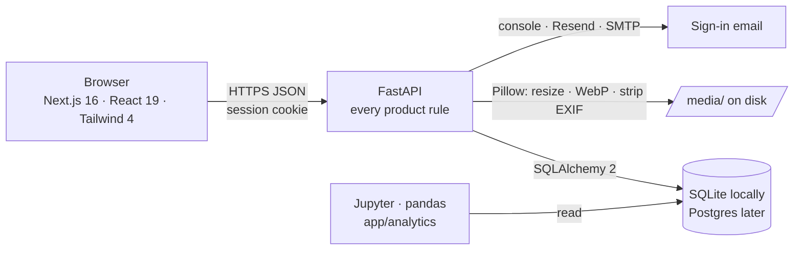
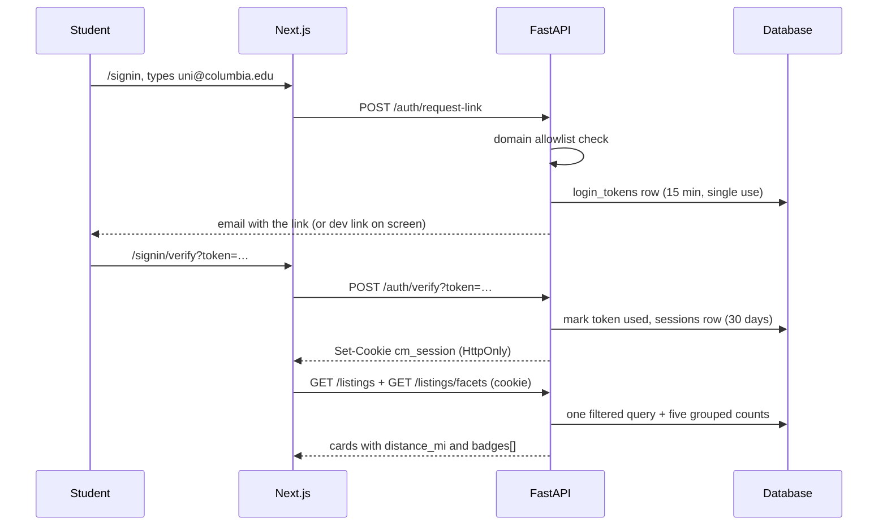
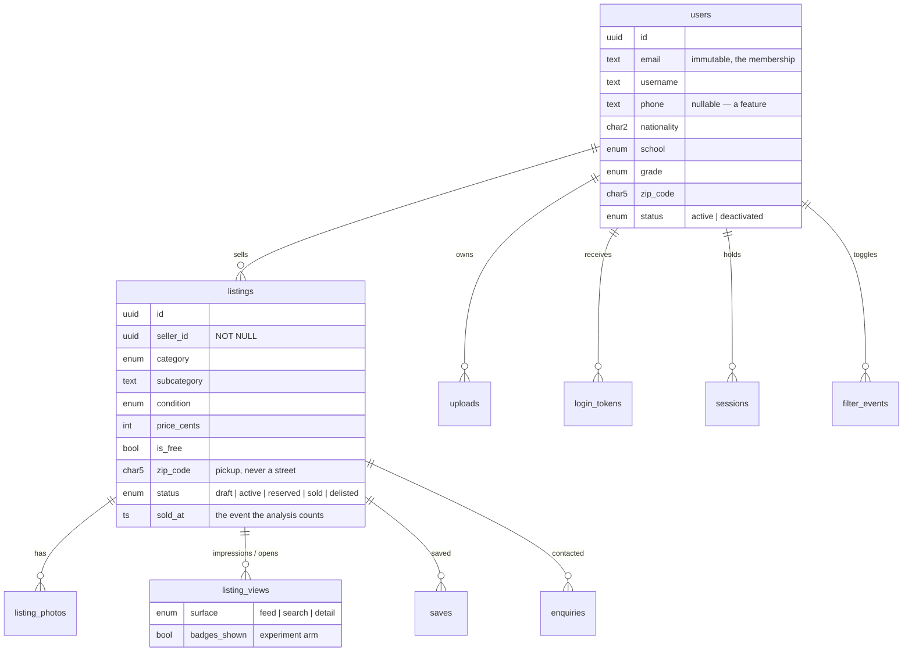

# Architecture

Columbia Market is three pieces and one database. A Next.js app the student
sees, a FastAPI service that holds every rule, and a database the browser never
talks to directly. Python does the analysis on the same tables.



| Piece | Choice | Why |
|---|---|---|
| Frontend | Next.js App Router + TypeScript + Tailwind v4 | Brian's Figma tokens map one-for-one onto `globals.css` |
| Backend | FastAPI + Uvicorn | Typed endpoints, free API docs, same language as the analysis |
| Data access | SQLAlchemy 2, `create_all()` at startup | Postgres is a `DATABASE_URL` change; Alembic when the schema stabilises |
| Sign-in | Self-hosted magic links | No passwords, no reset flow, tokens and sessions revocable because they are rows |
| Photos | Pillow → WebP on local disk | The browser never writes to storage, so the metadata strip cannot be skipped |
| Analysis | pandas | One function per research question in `app/analytics/questions.py` |

## The one rule that shapes everything

**Overlap-only disclosure** (`UX_SPEC.md` §5.3). A viewer is shown one of a
seller's attributes *only where they already share it*. The API implements it
structurally rather than by hiding fields in the UI:

- Cards and detail pages carry `badges: []` and `distance_mi`, both computed
  server-side for the viewer (`services/badges.py`, `services/geo.py`).
- The seller block on a detail page has exactly six keys: `username`,
  `display_name`, `is_verified`, `member_since`, `badges`, `can_receive_sms`.
  Nationality, school, grade, email and phone are never in it.
- Email and phone cross the wire in exactly one response, `POST
  /listings/{id}/enquiry`, at the moment the buyer taps Email or Text.
- `tests/test_disclosure.py` builds a seller from values that cannot appear
  anywhere else and greps every response a stranger can fetch for them.

## Request flow



## Backend layout

```
backend/
  app/
    main.py            app factory, CORS, /media static mount, lifespan
    config.py          every setting, with working defaults; .env overrides
    db.py              engine, session, create_all / reset_all
    enums.py           the contractual enum values (UX_SPEC §4.5)
    models.py          ORM schema (UX_SPEC §4) — no source column, seller_id NOT NULL
    schemas.py         request/response shapes; validators for username, phone, nationality
    security.py        magic links and sessions — no passwords
    services/
      domains.py       the four-domain membership rule, school prefill
      geo.py           64-ZIP NYC metro table, haversine, radius → ZIP list
      countries.py     ISO-3166 list for the nationality picker
      badges.py        overlap-only disclosure. Read this one.
      feed.py          ONE filter builder for the page and the facets; serializers; impressions
      photos.py        resize · WebP · strip metadata
      mailer.py        console / Resend / SMTP
    routers/
      auth.py          email-check, signup, request-link, verify, signout
      users.py         /me, /me/listings, /me/saved, deactivate
      listings.py      feed, facets, detail, post, PATCH, save, enquiry, filter events
      photos.py        POST /photos
      reference.py     /zips, /reference/enums, /reference/countries
    analytics/
      frames.py        database → pandas
      questions.py     the research questions
  scripts/seed.py      loads ../data/*.csv (Kobe's corpus); --demo-email, --limit
  tests/               59 tests; run with `pytest`
```

## The feed and its live counts

`GET /listings` and `GET /listings/facets` take the same query string and go
through the same `where_clauses()` in `services/feed.py`, so the page and the
sidebar can never disagree about what a filter means.

Every facet count is *"what you would get if you applied this one filter, with
all the other active filters still on"*. The whole sidebar is five SQL
statements regardless of how many enum values exist:

1. `COUNT(*)` plus three conditional counts for the trust toggles (same ZIP,
   same nationality, same school) over the fully filtered set.
2. `GROUP BY category` with the category and subcategory filters lifted.
3. `GROUP BY subcategory` with the subcategory filter lifted.
4. `GROUP BY condition` with the condition filter lifted.
5. Five conditional counts, one per distance preset, with the radius lifted.

Radius is resolved to a list of ZIP codes (`geo.zips_within`) and applied as
`zip_code IN (...)`, so the index on `listings.zip_code` is used and no
per-row distance is computed in SQL. `closest` sort is done in Python, which
is honest and fast at pilot scale.

With a text query the default sort switches to `closest` (§5.4).

Each page of results writes one `listing_views` row per card (surface `feed`
or `search`) with `badges_shown`, so the funnel and the badge experiment have
data from the first request.

## Auth

- Domain allowlist: `columbia.edu, gsb.columbia.edu, cumc.columbia.edu,
  tc.columbia.edu` (`ALLOWED_EMAIL_DOMAINS`). Exact match on the domain.
- `POST /auth/signup` creates the member and issues a link; `POST
  /auth/request-link` issues one for an existing member and answers
  identically for unknown addresses.
- Links are `secrets.token_urlsafe(32)`, single use, 15 minutes; resend is
  locked for 60 seconds.
- `POST /auth/verify` marks the token used, sets `is_verified`, reactivates a
  deactivated account, and sets an HttpOnly `cm_session` cookie (30 days,
  `SameSite=Lax`, `Secure` when `COOKIE_SECURE=true`).
- Anything that shows listings requires the cookie. Reference endpoints do not.

## Photos

`POST /photos` (multipart) → `services/photos.py`: size ≤ 10 MB, format in
JPG/PNG/WebP (HEIC when `pillow-heif` is installed), EXIF orientation applied,
alpha flattened onto white, resized to ≤ 1600 px, saved as WebP with no
metadata under `MEDIA_DIR`, served at `/media/<name>.webp`. An `uploads` row
records the owner; `POST /listings` and `PATCH /listings/{id}` only accept
URLs from that member's own uploads.

## Data model



Seller attributes are never copied onto a listing; they are joined at read
time, so a profile edit corrects every badge at once. Deleting is a status
change, never a row deletion.

## Seed data

`seed/` at the repo root is Kobe's deterministic generator (standard library
only) and `data/` its committed output: 1,000 members, 1,500 listings, photos
and the four event tables, plus a loadable `seed.sql`. `backend/scripts/seed.py`
loads the CSVs through the ORM. Two things happen on the way in:

- **The external tier is dropped.** The generator still emits 150 listings with
  `source != 'internal'`; the schema has no such column, so those rows and every
  view, save and enquiry that references them are skipped and counted.
- **`--demo-email you@columbia.edu`** adds your own account with three listings,
  and **`--limit N`** loads only the first N listings for a fast local database.

Seeded photos are root-relative (`/photos/<listing>/<n>.webp`) and served by
Next.js from `frontend/public/photos`; they are not committed and are rebuilt
with `scripts/fetch_photos.py` (real photos) or `scripts/make_photos.py`
(gradients). Uploads made through the app are served by the API from `/media`.
`absolute_url()` in `services/photos.py` tells the two apart.

## Configuration

Everything has a working default; `backend/.env` overrides. See
`backend/.env.example` for the full list: origins, the domain allowlist, the
mailer, cookie security, the badge experiment switch.

## What is local-only

SQLite, photos on disk, the console mailer, `create_all()` at startup, and the
dev link in API responses. Each is one environment change away from the
production shape (Postgres, object storage, Resend/SMTP, Alembic,
`EMAIL_DEV_MODE=false`).
