# Columbia Market — UI/UX Specification

> **Amended 2026-09-02.** Three decisions changed this document after it was
> written — the external tier (§2, §4.2, §5.5, §9) is removed, sign-in admits
> four Columbia domains (§4.1, §6.1, §6.2), and a `delisted` status exists.
> See [`DECISIONS.md`](DECISIONS.md); where the two disagree, that file wins.

**Status:** design complete for the six screens listed below. No code written yet.
**Source of truth for visuals:** [Figma — CBS_marketplace](https://www.figma.com/design/ojcR7eFv5r7mP1uUpLfhYD/CBS_marketplace)
**Source of truth for behaviour:** this document.

> **If you are an AI assistant helping a teammate:** read this file end to end before
> writing any code. It contains the data model, the enums, the derived logic and the
> per-screen behaviour. The PNGs in `docs/screens/` are the visual reference — they
> match this document exactly. Only one person on the team has the Figma connection,
> so do not assume you can open the file.

---

## 1. What we are building

A secondhand marketplace restricted to Columbia students, verified by
`@columbia.edu` email. The structural model is Karrot (당근마켓): a local feed
sorted by proximity, with a strong trust signal attached to every seller. Karrot
uses GPS-verified neighbourhoods; we use **ZIP code + distance in miles**, plus
three affiliation attributes.

**The one rule that shapes the whole product — overlap-only disclosure.**
A viewer is shown one of a seller's attributes *only where they already share it*.
Someone with nothing in common sees no badges at all and learns neither the
seller's country nor their school. This is not a privacy afterthought; it is the
mechanic being tested. See §6.2.

### Screens in scope

| # | Screen | Desktop | Mobile |
|---|---|---|---|
| 1 | Sign Up | ✅ | ✅ |
| 2 | Sign In (email link) | ✅ | ✅ |
| 3 | Feed / Search | ✅ | ✅ |
| 4 | Item Detail | ✅ | ✅ |
| 5 | Upload Item | ✅ | ✅ |
| 6 | Profile & Account settings | ✅ | ✅ |

### Explicitly out of scope

Payments, shipping, ratings/reviews, in-app chat threads, real identity
verification, push notifications, and **housing or sublets** (filtering rental
listings by nationality raises US fair-housing problems that filtering desks does
not).

---

## 2. Divergences from `PROPOSAL.md`

`PROPOSAL.md` was written first and the design moved past it in three places.
**Where they conflict, this document wins.** Someone should reconcile the proposal
before submission.

| Topic | PROPOSAL.md says | Design as built | Why |
|---|---|---|---|
| Location attribute | "location" (neighbourhood) | **ZIP code**, with a **distance slider in miles** (0.5–10 mi, default 2.5) | A neighbourhood label is fuzzy and unjoinable; a ZIP is a real key with a centroid you can compute distance from. Lets the buyer set their own radius instead of accepting a label. |
| Fourth attribute | "industry" | **grade** (undergraduate / graduate / faculty-staff) | Industry is close to meaningless for undergraduates and unverifiable for everyone. Grade is what actually predicts what you are buying and selling. |
| Audience selection on posting | Seller picks which circle sees a listing | **Removed.** Sellers do not choose an audience. | Visibility is decided by each *buyer's* filters. A seller-side audience picker duplicated that control and made reach unpredictable. Posting is now one form with no audience step. |
| Contact | "a contact button" | **Email seller** always; **Text seller** only if the seller supplied a phone number | Phone is optional at sign-up (§5.1), so the contact block has two shapes. |

The four filterable attributes are therefore: **ZIP/distance, nationality,
college/school, grade.**

---

## 3. Design system

All colours exist as Figma variables in the collection `CBS Marketplace`. Use the
token name in code (CSS custom property, Tailwind theme key, whatever) — never a
raw hex inline.

### 3.1 Colour

| Token | Hex | Used for |
|---|---|---|
| `color/brand/deep` | `#1D4F91` | Every primary action, active filter, selected state. Columbia's web blue. This is what Karrot's orange does for them. |
| `color/brand/primary` | `#2E6FBA` | Hover / secondary emphasis |
| `color/brand/accent` | `#75AADB` | Accents |
| `color/brand/light` | `#9BCBEB` | Columbia Blue. Avatars, logo on dark, dark-panel body text |
| `color/brand/tint` | `#E8F2FA` | Badge and selected-row backgrounds, hero blocks |
| `color/brand/tint-2` | `#C4D8E2` | Rare, larger tinted surfaces |
| `color/bg/page` | `#F7FAFC` | Page background |
| `color/bg/surface` | `#FFFFFF` | Cards, inputs, bars |
| `color/bg/muted` | `#F1F5F9` | Inert rows, disabled buttons, search field |
| `color/border/default` | `#E2E8F0` | Card and divider borders |
| `color/border/strong` | `#CBD5E1` | Input borders |
| `color/text/primary` | `#111827` | Headings and values |
| `color/text/secondary` | `#64748B` | Descriptions, labels |
| `color/text/tertiary` | `#94A3B8` | Hints, metadata, placeholders |
| `color/text/inverse` | `#FFFFFF` | Text on deep blue |
| `color/status/success` | `#16A34A` | Valid, verified, on sale |
| `color/status/warning` | `#F59E0B` | Reserved, expired link |
| `color/status/danger` | `#DC2626` | Validation errors, destructive |

Two colours are used raw and are **not** tokens, because they are photo overlays
rather than UI: `#33465C` (dark pills over item photos) and `#151B24` (lightbox
backdrop).

### 3.2 Typography

Inter throughout. Figma style names are `Regular`, `Medium`, `Semi Bold`, `Bold`
(note the spaces — `SemiBold` will fail).

| Role | Desktop | Mobile | Weight | Tracking |
|---|---|---|---|---|
| Display | 46 / 54 | 22 / 29 | Bold | −2% |
| H1 | 32 | 21 | Bold | −2% |
| H2 | 24 | 18 | Bold | −2% |
| H3 | 19 | 17 | Bold | −1% |
| Body | 15 / 23 | 14.5 / 24 | Regular | 0 |
| Label | 13 | 13 | Semi Bold | 0 |
| Meta / hint | 12 | 11.5 | Regular | 0 |
| Overline | 11 | 11 | Semi Bold | +8% |
| Price | 36 / 24 / 17 | 30 / 19 / 16.5 | Bold | −2 to −3% |

### 3.3 Geometry

- **Radius:** inputs and small controls `10–11`, cards `14–16`, buttons `11–12`, pills `999`, photo thumbnails `9–12`.
- **Spacing:** 4-based. Common gaps `8 / 10 / 14 / 20 / 24 / 28`. Card padding `22–32` desktop, `16–20` mobile.
- **Borders:** `1px` default, `1.5px` for focus / selected / error.
- **Shadow:** one elevation only — `0 6px 24px rgba(13,31,64,0.06–0.12)`.
- **Breakpoints:** desktop frames are `1440` wide with `40–120px` page padding; mobile frames are `390` (iPhone 14/15 logical width). No tablet layout was designed — treat ≥1024 as desktop.
- **Icons:** 24×24 stroke icons, `1.8px` stroke, drawn inline as SVG. Rendered at 14–26px.

### 3.4 Recurring components

`Button` (primary / ghost / disabled) · `Input` (default / focus / error / valid / locked) ·
`Select` · `Segmented control` · `Chip` (filter, category, removable) ·
`Match badge` · `Toggle` · `Checkbox` · `Item card` · `List row` ·
`Dropdown panel` · `Distance slider` · `Bottom sheet` (mobile) · `Bottom tab bar` (mobile).

See `docs/screens/91-foundations.png`.

---

## 4. Data model

Field names are `snake_case` to suit a Python/SQL backend. Adjust for your ORM,
but keep the enum *values* exactly as written — the UI copy depends on them.

### 4.1 `users`

| Field | Type | Notes |
|---|---|---|
| `id` | uuid PK | |
| `email` | text, unique, NOT NULL | Must match `^[a-z0-9._%+-]+@columbia\.edu$`, case-insensitive. **Immutable.** It is the identity. |
| `username` | text, unique, NOT NULL | 3–20 chars, `[a-zA-Z0-9._]`. Displayed with a leading `@`. The only name buyers see. |
| `display_name` | text, nullable | Optional real name shown on the profile page |
| `phone` | text, **nullable** | E.164 preferred. **Optional at sign-up.** See §5.1. |
| `phone_contact_enabled` | bool, default `true` | Meaningless when `phone IS NULL`. Controls whether "Text seller" renders. |
| `nationality` | text (ISO-3166 alpha-2 recommended) | Self-declared, never verified |
| `school` | enum `school` | Self-declared; could be cross-checked against the email domain later |
| `grade` | enum `grade` | |
| `zip_code` | char(5) NOT NULL | NYC metro only in the pilot |
| `default_radius_mi` | numeric, default `2.5` | Where the feed slider starts |
| `default_filter_same_zip` | bool, default `false` | |
| `default_filter_same_nationality` | bool, default `false` | |
| `default_filter_same_school` | bool, default `false` | |
| `is_verified` | bool, default `false` | True once an email link has been opened |
| `status` | enum `active \| deactivated` | |
| `created_at` / `updated_at` | timestamptz | |

Never expose `email`, `phone`, `nationality`, `school`, `grade` or the raw
`zip_code` of another user through a public API response. See §6.2.

### 4.2 `listings`

| Field | Type | Notes |
|---|---|---|
| `id` | uuid PK | |
| `seller_id` | uuid FK → users | NULL for external listings |
| `source` | enum `source`, default `internal` | |
| `title` | text NOT NULL | ≤ 60 chars |
| `description` | text | ≤ 1000 chars |
| `category` | enum `category` NOT NULL | |
| `subcategory` | text, nullable | Must belong to `category` (§4.5) |
| `condition` | enum `condition` NOT NULL | |
| `price_cents` | integer NOT NULL | `0` means free |
| `is_free` | bool, default `false` | Mutually exclusive with a non-zero price |
| `is_negotiable` | bool, default `false` | |
| `zip_code` | char(5) NOT NULL | Pickup ZIP. Street address is never collected. |
| `status` | enum `listing_status`, default `active` | |
| `view_count` / `save_count` / `enquiry_count` | integer, default 0 | |
| `external_url` | text, nullable | Required when `source != 'internal'` |
| `posted_at` | timestamptz | |
| `sold_at` | timestamptz, nullable | **The event the analysis counts.** |

### 4.3 `listing_photos`

`id`, `listing_id` FK, `url`, `position` (0 = cover), `created_at`.
Max **10** per listing, **10 MB** each, JPG / PNG / HEIC. Position 0 is the feed
thumbnail.

### 4.4 Event tables (for the analysis)

- `listing_views` — `listing_id`, `viewer_id` (nullable), `viewed_at`, `surface` (`feed | search | detail`)
- `saves` — `listing_id`, `user_id`, `created_at`
- `enquiries` — `listing_id`, `buyer_id`, `channel` (`email | sms`), `created_at`
- `filter_events` — `user_id`, `filter_key`, `value`, `result_count`, `created_at`
  → this is what answers *"which of the filters is doing the work"*, so log every toggle and every slider release.

### 4.5 Enumerations

```
category         furniture | textbooks | electronics | kitchen_home |
                 clothing | bikes_transport | sports | free_stuff

subcategory      furniture:      desks, chairs, beds_mattresses,
                                 storage_shelving, sofas_tables
                 (other categories are single-level for now)

condition        new | like_new | used_good | used_fair
                 UI labels: "New", "Like new", "Used — good", "Used — fair"

grade            undergraduate | graduate | faculty_staff

listing_status   draft | active | reserved | sold

source           internal | ebay | facebook | karrot

school           columbia_college | seas_undergrad | general_studies |
                 cbs | law | sipa | seas_grad | teachers_college |
                 journalism | public_health | gsas | arts | gsapp | vps
                 (grouped in the UI as UNDERGRADUATE / GRADUATE & PROFESSIONAL)
```

### 4.6 ZIP reference table

Needed for autocomplete and for distance. Ship it as a static table — do not call
a geocoding API at request time.

| ZIP | Neighbourhood | Miles from campus (116th & Broadway) |
|---|---|---|
| 10027 | Morningside Heights | 0.2 |
| 10025 | Upper West Side | 0.9 |
| 10031 | Hamilton Heights | 1.1 |
| 10026 | South Harlem | 1.3 |
| 10024 | Upper West Side (lower) | 1.6 |
| 10036 | Hell's Kitchen | 3.4 |
| 10018 | Midtown West | 4.1 |
| 11106 | Astoria | 5.2 |

Extend to the full NYC metro set (~42 ZIPs) with `(zip, neighbourhood, borough,
lat, lon)`. **Reject anything outside the NYC metro** at sign-up with the message
in state `A8`.

---

## 5. Derived logic

### 5.1 Optional phone → two contact shapes

Phone is optional at sign-up, and a member can clear it later in Profile &
account. This produces two variants of the contact block on the detail screen:

- **Number on file and `phone_contact_enabled`** → `[Email seller] [Text seller]`, side by side, email primary.
- **No number, or texting disabled** → a **single full-width `Email seller` button.** Not a disabled second button, not a gap. See `D12` in `docs/screens/95-states-d-detail.png`.

On mobile the bottom action bar drops the SMS icon button and the email button
takes the space. Email is always available and can never be turned off.

Neither the address nor the number is printed on the page. They are released at
the moment the buyer taps the button (`mailto:` / `sms:`), and an `enquiries` row
is written with the channel.

### 5.2 Distance

```
distance_mi = haversine(zip_centroid(viewer.zip_code),
                        zip_centroid(listing.zip_code))
```

Rounded to one decimal. ZIP centroid to ZIP centroid — **no GPS permission is
ever requested and no street address is stored.** Same-ZIP listings show as
`0.0–0.5 mi`; that is expected and should not be special-cased.

The radius filter is `distance_mi <= radius`, where radius comes from the slider
(`0.5 / 1 / 2.5 / 5 / 10` presets, continuous in between, default from
`users.default_radius_mi`).

### 5.3 Match badges

Computed per `(viewer, listing)` pair at read time. Never stored on the listing.

```python
def badges(viewer, seller):
    if seller is None:            # external listing
        return []
    out = []
    if viewer.zip_code   == seller.zip_code:   out.append("SAME ZIP")
    if viewer.nationality== seller.nationality:out.append("SAME COUNTRY")
    if viewer.school     == seller.school:     out.append("SAME SCHOOL")
    return out
```

An attribute that does not match is **not returned to the client at all** — not
returned as `false`, not returned as `null`. A viewer with no overlap receives an
empty array and the seller card renders the "no shared attributes" state (`D8`).
Grade is used for filtering but does not currently produce a badge.

### 5.4 Feed ranking

Default sort is `newest`. Available sorts: `newest`, `closest`,
`price_asc`, `price_desc`, `most_saved`. When a text query is present the default
switches to `closest`.

Ranking is not personalised beyond the active filters. Every count shown next to
a filter is the count *if you applied it*, evaluated against all other active
filters — so the numbers move as filters change. That live count is the product's
core honesty mechanism; do not fake it with static values.

### 5.5 Two-tier feed

`internal` listings carry match badges and a seller card. Non-internal listings
carry an `EXTERNAL` pill plus a source tag (`eBay`, `Facebook Marketplace`), have
no badges, no seller card, and **link out** — clicking opens the interstitial
`D11` and then the source URL. We aggregate and point; we never host the
external transaction.

---

## 6. Screens

Images are in `docs/screens/`. Each screen lists the route, what it renders, and
the rules that are not visible in the picture.

### 6.1 Sign Up — `/signup`

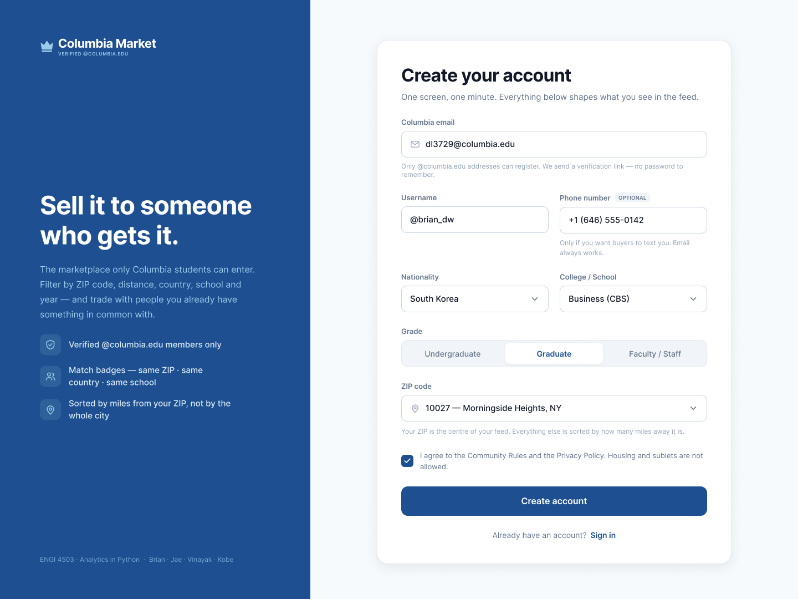
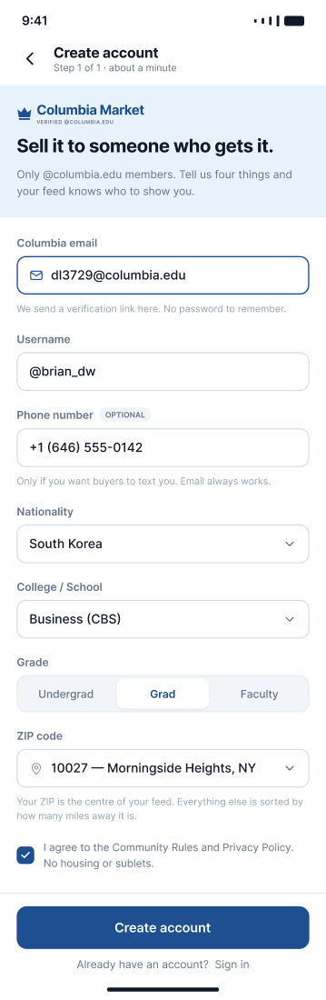

Single screen, no wizard. Desktop is a split layout — brand panel left (560px),
form card right. Mobile is one scroll with a sticky CTA.

| Field | Required | Rules |
|---|---|---|
| Columbia email | ✅ | Must end `@columbia.edu`. Validated as you type, not on submit. |
| Username | ✅ | Uniqueness checked live: checking → taken (with 3 suggestions) → available |
| Phone number | ❌ **optional** | Tagged `OPTIONAL`. Hint: "Only if you want buyers to text you. Email always works." |
| Nationality | ✅ | Searchable dropdown, 195 entries, 4 most common at Columbia pinned to the top |
| College / School | ✅ | Dropdown grouped by UNDERGRADUATE / GRADUATE & PROFESSIONAL |
| Grade | ✅ | Three-way segmented control, never a dropdown |
| ZIP code | ✅ | Typing 3 digits filters the NYC ZIP table; result shows neighbourhood + miles from campus |
| Terms checkbox | ✅ | |

The submit button stays **disabled until every required field resolves**, and its
helper text names what is still missing ("3 required fields left — ZIP code,
nationality, phone number"). There are no ZIP suggestion chips — the autocomplete
dropdown is the only ZIP affordance.

### 6.2 Sign In — `/signin`

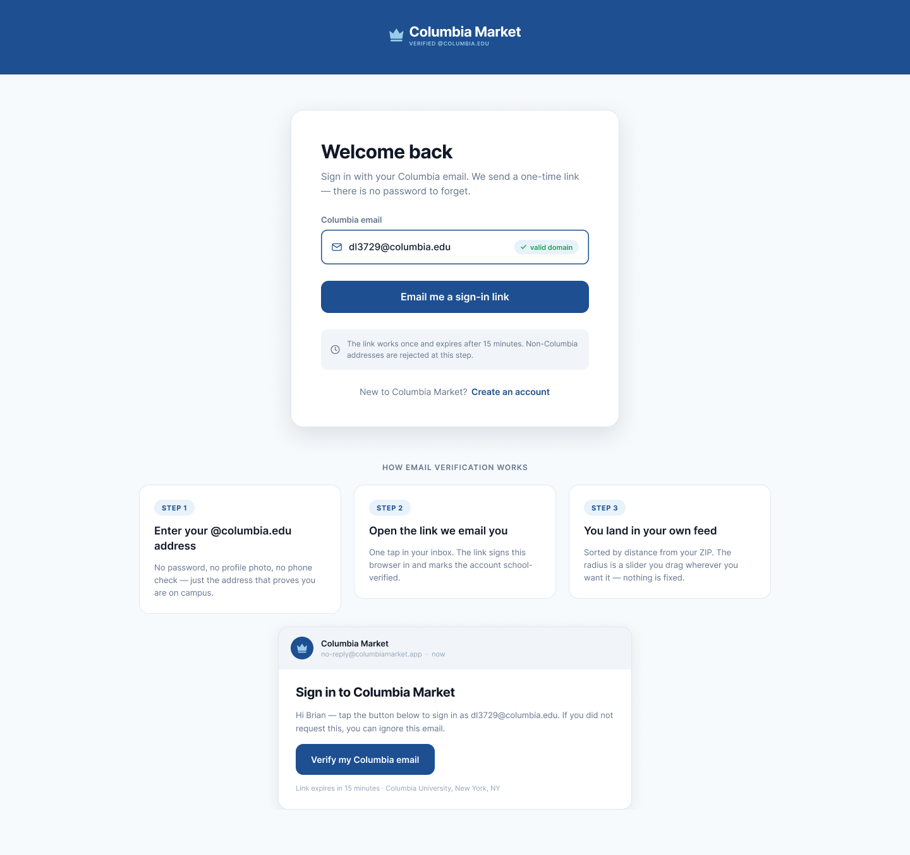
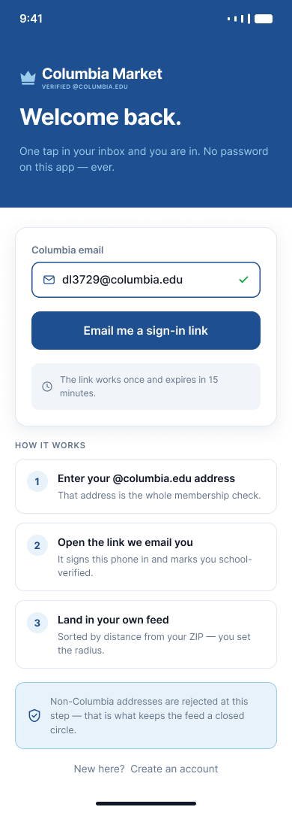

**There is no password anywhere in this product.** Enter a `@columbia.edu`
address, receive a one-time link, open it, you are in.

- Link is **single-use** and **expires after 15 minutes**.
- Resend is locked for **60 seconds** with a visible countdown.
- Three link outcomes must be handled: verified, expired, already-used. Both
  failures offer the same one-tap recovery (send a new link) rather than an error page.
- Non-Columbia addresses are rejected at this step. There is no browsing without an account in the pilot.
- The screen does **not** promise a fixed radius. Copy is "sorted by distance from
  your ZIP — you set the radius."

### 6.3 Feed / Search — `/` and `/search`

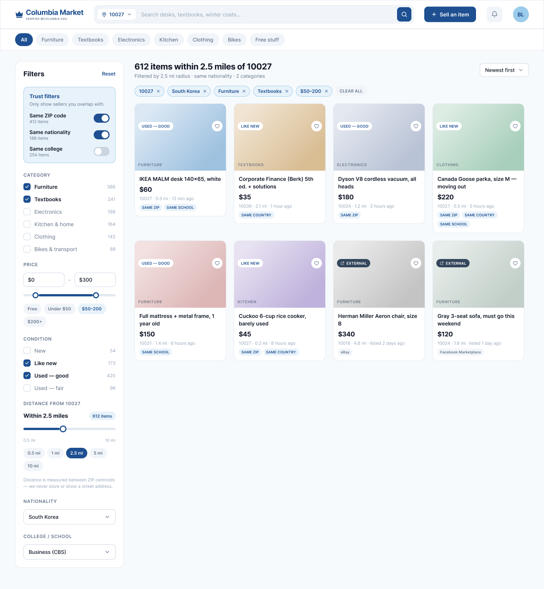
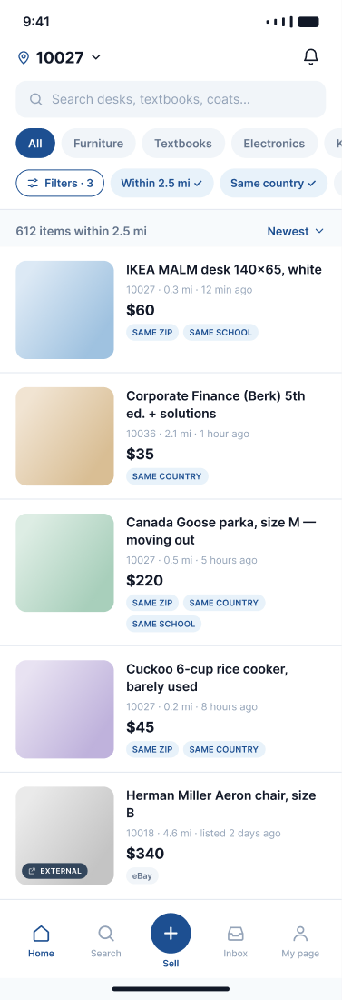

Desktop: top nav (logo, search with ZIP chip, Sell, notifications, avatar) →
category tab strip → 288px filter sidebar + 4-column card grid.
Mobile: header with ZIP selector → search → category chips → filter chip row →
**list rows** (not a grid) → 5-item bottom tab bar (`Home / Search / Sell / Inbox / My page`)
with a raised centre Sell button. All filters live in a bottom sheet (`C10`).

Sidebar order, top to bottom:

1. **Trust filters** (tinted card) — `Same ZIP code` / `Same nationality` / `Same college` toggles, each with a live count
2. **Category** — checkboxes with counts, two levels
3. **Price** — min/max inputs, dual-handle slider over a listing histogram, presets
4. **Condition** — checkboxes with counts
5. **Distance from {ZIP}** — value line, slider, `0.5 / 1 / 2.5 / 5 / 10 mi` presets, and the note that distance is ZIP-centroid based
6. **Nationality** — select
7. **College / School** — select

The location chip in the search bar shows **the ZIP only** (`10027`) — no mileage.
Mileage appears in exactly two places: the distance slider (a filter you set) and
each card's metadata (an actual distance to that item). Anywhere else it is
ambiguous.

Card anatomy: photo (4:3) with condition pill and save heart · category overline ·
title (2 lines) · price · `ZIP · X.X mi · relative time` · match badges ·
external source tag when applicable.

### 6.4 Item Detail — `/listings/:id`

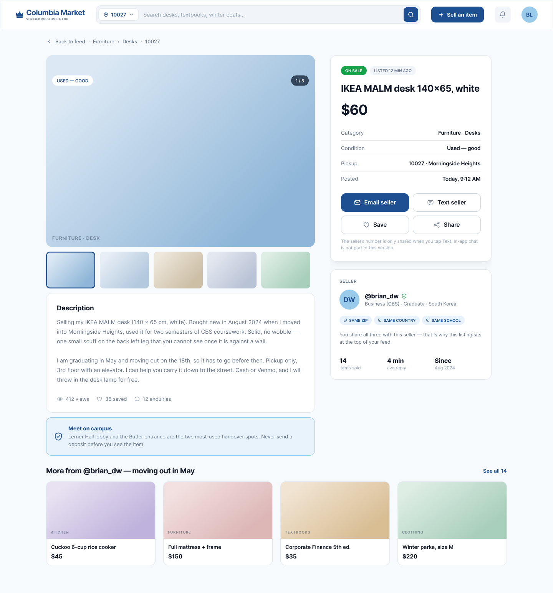
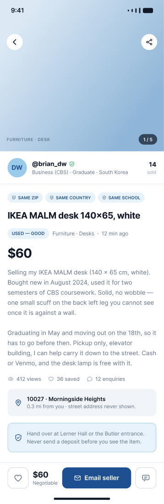

Desktop is two columns: gallery + description + safety note on the left (700px),
a sticky action panel on the right (420px). Mobile is a full-bleed photo with
floating back/share, then content, then a fixed bottom action bar.

Right panel order: status pill · title · price · attribute table
(Category / Condition / Pickup / Posted) · **contact buttons (§5.1)** ·
Save + Share · the phone-disclosure line · seller card · "more from this seller".

The seller card is where overlap-only disclosure becomes visible, and it is worth
being pedantic about: **the item, the price and the photos are identical for every
viewer; only the seller block changes.** That is what makes the internal-vs-external
engagement comparison a clean experiment — the difference cannot come from the item.

Listing statuses render differently: `active` (green pill, contact enabled),
`reserved` (amber, still visible in the feed, "join the queue"), `sold`
(struck-through price, dimmed, contact locked, drops out of search but the page
stays reachable).

### 6.5 Upload Item — `/sell`

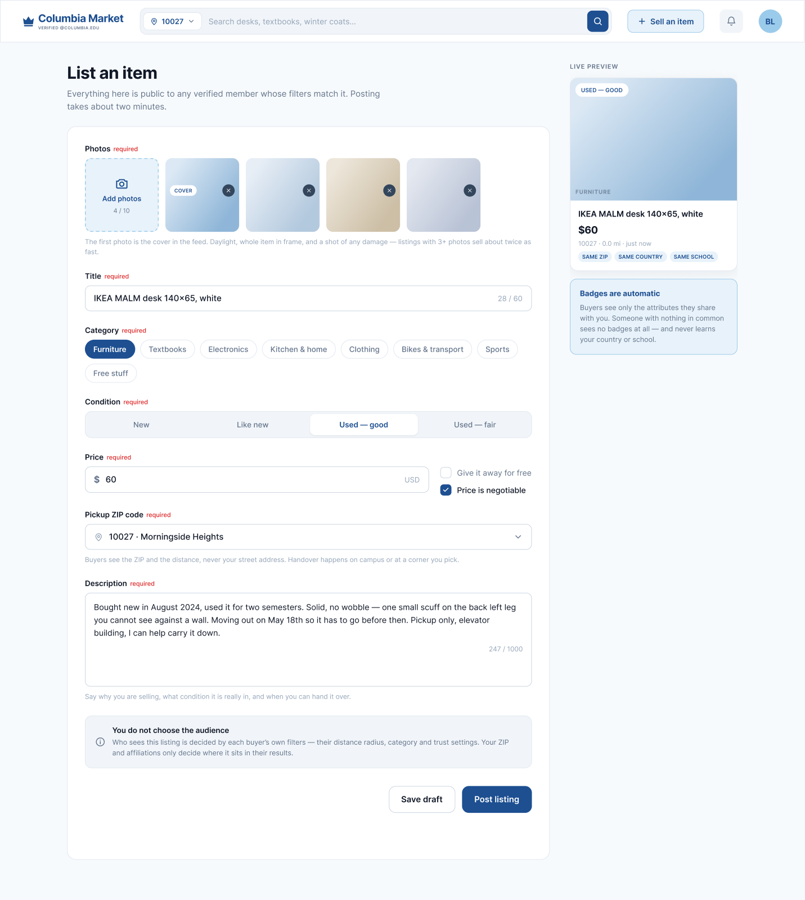
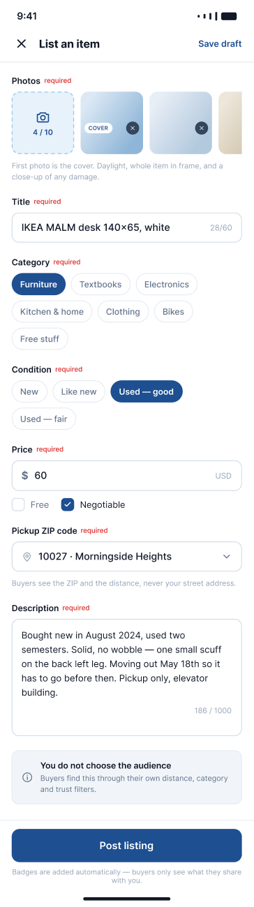

Photos → title → category → condition → price → pickup ZIP → description → post.
Desktop shows a live preview of the feed card in a right column.

- **No audience picker.** The form ends with a note: *"You do not choose the audience — who sees this listing is decided by each buyer's own filters."* CTA reads **`Post listing`**.
- Photos: up to 10, 10 MB each, first is the cover, drag to reorder. Four states: empty, uploading (progress), rejected (over size), full.
- Price: `Give it away for free` disables the amount; `$0` on its own is an error ("enter a price, or tick free").
- Pickup: **ZIP only**, no suggestion chips. Buyers see the ZIP and the distance, never a street address.
- Blocked submit lists every missing field with a jump link.

### 6.6 Profile & Account — `/settings/profile`

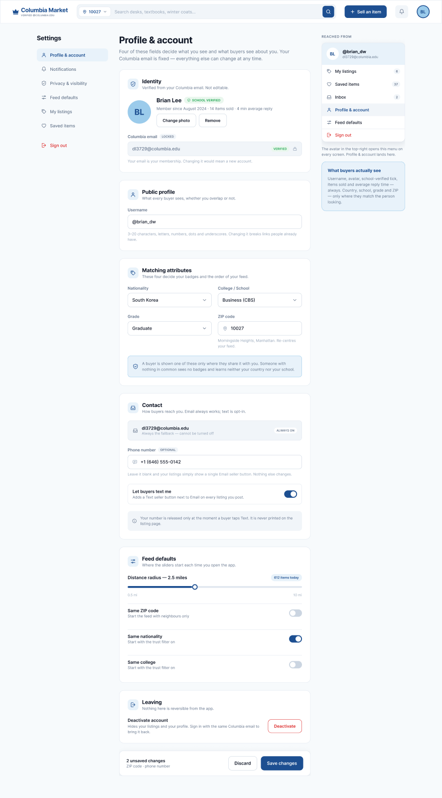
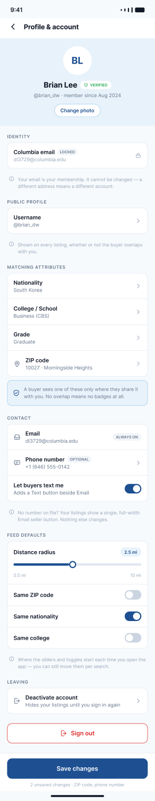

Reached from the **avatar menu in the top-right** (My listings / Saved items /
Inbox / Profile & account / Feed defaults / Sign out). On mobile it is the
`My page` tab.

| Group | Contents |
|---|---|
| Identity | Avatar, verified tick, member-since. **Columbia email is locked** — changing it would mean a new account. |
| Public profile | Username (editable) |
| Matching attributes | Nationality, College/School, Grade, ZIP code — plus a reminder of the disclosure rule. Changing the ZIP re-centres the feed. |
| Contact | Email row marked `ALWAYS ON` (cannot be disabled) · Phone tagged `OPTIONAL` · `Let buyers text me` toggle · the note that a blank number simply means a full-width Email button |
| Feed defaults | Default distance radius slider, and default state for the three trust filters |
| Leaving | Deactivate account (reversible by signing in again), Sign out |

Desktop shows an unsaved-changes bar naming the changed fields.

---

## 7. Interaction state catalogue

Every state below is drawn in Figma on the page `05 · Screen States` and exported
to `docs/screens/92-…` through `96-…`. Use the IDs when referring to a state in a
ticket or a commit message.

**A — Sign Up** (`92-states-a-signup.png`)
`A1` email empty · `A2` wrong domain · `A3` valid · `A4` username checking ·
`A5` taken + suggestions · `A6` available · `A7` ZIP autocomplete ·
`A8` ZIP not in NYC · `A9` ZIP resolved · `A10` nationality dropdown ·
`A11` school dropdown · `A12` grade segmented · `A13` submit disabled · `A14` submitting

**B — Sign In** (`93-states-b-signin.png`)
`B1` empty · `B2` non-Columbia · `B3` valid · `B4` sending · `B5` check inbox ·
`B6` resend locked (0:42) · `B7` resend available · `B8` verified · `B9` expired ·
`B10` already used

**C — Feed & Search** (`94-states-c-feed.png`)
`C1` search focused (recent + trending) · `C2` typing suggestions with counts ·
`C3` results header · `C4` no results → widen radius · `C5` loading skeletons ·
`C6` distance slider at five steps with live counts · `C7` sort dropdown ·
`C8` price popover with histogram · `C9` category tree · `C10` mobile filter sheet

**D — Item Detail** (`95-states-d-detail.png`)
`D1` thumbnails/dots · `D2` lightbox · `D3` on sale · `D4` reserved · `D5` sold ·
`D6` full overlap · `D7` partial overlap · `D8` no overlap · `D9` saved ·
`D10` owner view · `D11` external redirect · **`D12` contact with / without a phone number**

**E — Upload** (`96-states-e-upload.png`)
`E1` photos empty · `E2` uploading · `E3` rejected · `E4` full 10/10 ·
`E5` category picker tree · `E6` free · `E7` missing price · `E8` submit blocked ·
`E9` posted

---

## 8. API sketch

Not final — a starting point that matches the screens.

```
POST   /auth/signup            {email, username, phone?, nationality, school,
                                grade, zip_code}          → 201, sends link
POST   /auth/request-link      {email}                    → 202
GET    /auth/verify?token=     → sets session, 302 to /
POST   /auth/signout

GET    /me                                                 → full own profile
PATCH  /me                     {username?, phone?, phone_contact_enabled?,
                                nationality?, school?, grade?, zip_code?,
                                default_radius_mi?, default_filter_*?}
POST   /me/deactivate

GET    /listings               ?q=&category=&subcategory=&condition=
                               &price_min=&price_max=&radius_mi=
                               &same_zip=&same_nationality=&same_school=
                               &source=&sort=&cursor=
GET    /listings/:id
POST   /listings               (multipart, ≤10 photos)
PATCH  /listings/:id
POST   /listings/:id/sold
POST   /listings/:id/save   |  DELETE /listings/:id/save
POST   /listings/:id/enquiry   {channel: "email"|"sms"}   → returns the address
                                                            or number, logs the event

GET    /zips?q=100             → [{zip, neighbourhood, borough, miles_from_campus}]
GET    /filters/counts         ?<same params as /listings> → live counts per facet
```

`GET /listings` must return, per item, the **computed** fields the card needs:
`distance_mi`, `badges[]`, `is_external`, `source_label`, `cover_photo_url`.
The client should never receive the seller's raw attributes and diff them itself.

---

## 9. Fake data guidance

The point of the seed data is that the screens look real and the analysis has
something to chew on. Suggested shape for ~1,000 members and ~1,500 listings:

- **Users** — 60% graduate, 35% undergraduate, 5% faculty/staff. Nationality: US ~35%, China ~18%, South Korea ~10%, India ~8%, remainder spread across ~30 countries. School: CBS and SEAS over-represented (the KCA community we are seeding from). ZIP: 10027 ~40%, 10025 ~15%, 10031 ~10%, remainder spread. **Leave ~30% of `phone` NULL** — the email-only contact layout must be exercised by the data, not just by a design state.
- **Listings** — furniture ~30%, textbooks ~20%, electronics ~15%, kitchen ~12%, clothing ~10%, rest split. Condition skews `used_good` (~45%) and `like_new` (~30%).
- **Prices** — log-normal per category. Furniture $20–400, textbooks $10–90, electronics $30–500, kitchen $10–120. About 8% free.
- **Seasonality** — listing volume should spike in **May** (cohort liquidates) and **August** (cohort arrives). Make the spike roughly 3× the trough; that mismatch is one of the research questions.
- **External tier** — ~150 listings across `ebay`, `facebook`, `karrot` with `seller_id` NULL and a plausible `external_url`. They must have no badges, by construction.
- **Events** — views ≫ saves ≫ enquiries (roughly 100 : 8 : 1). To make the internal-vs-external comparison interesting, do **not** hard-code a difference — generate both tiers with the same base rates and let the analysis find (or fail to find) the effect.
- **Sold** — ~35% of internal listings get a `sold_at`, median ~6 days after posting.

---

## 10. Suggested work split

- **Frontend** — §3 tokens first, then the shared components in §3.4, then screens in order 2 → 3 → 4 → 1 → 5 → 6. The states in §7 are the acceptance criteria; a screen is not done until its states render.
- **Backend** — §4 schema and §4.5 enums, then the ZIP table (§4.6) and distance function, then `GET /listings` with facet counts, then auth. The badge function (§5.3) belongs in the serializer, not the model.
- **Data / analysis** — §9 generator, then the `filter_events` and `enquiries` pipelines, which are what the research questions in `PROPOSAL.md` actually run on.

---

## 11. Open questions

1. Should `school` be verified from the email domain where possible, or stay self-declared for all four attributes?
2. Grade is filterable but produces no badge. Should there be a `SAME YEAR` badge, or is grade a filter-only attribute?
3. `reserved` has a "join the queue" affordance in the design but no queue model. Cut the queue, or add a `listing_queue` table?
4. External listings currently have no dedupe key. If eBay and Facebook both surface the same chair, we will show it twice.
5. The pilot is NYC-only by ZIP. What is the intended failure message for a legitimate Columbia member living outside the metro?

---

## 12. File index

| Path | What it is |
|---|---|
| `docs/screens/01…06-*-desktop.png` | The six desktop screens at 1440 |
| `docs/screens/01…06-*-mobile.png` | The six mobile screens at 390 |
| `docs/screens/90-user-flow.png` | Three journeys — getting in, buying, selling |
| `docs/screens/91-foundations.png` | Logo, colour tokens, type ramp, components |
| `docs/screens/92…96-states-*.png` | The interaction states in §7 |
| `PROPOSAL.md` | The original research proposal. See §2 for where it differs. |
